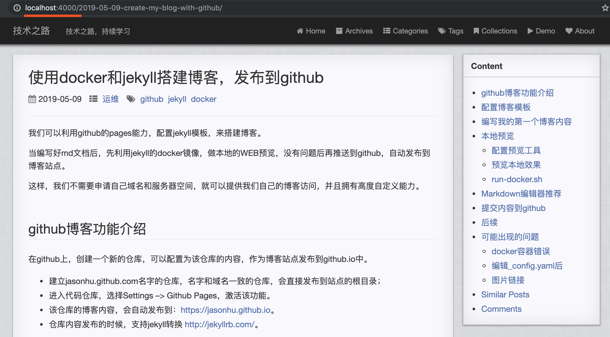

* content
{:toc}

我们可以利用github的pages能力，配置jekyll模板，来搭建博客。

当编写好md文档后，先利用jekyll的docker镜像，做本地的WEB预览，没有问题后再推送到github，自动发布到博客站点。

这样，我们不需要申请自己域名和服务器空间，就可以提供我们自己的博客访问，并且拥有高度自定义能力。


## github博客功能介绍
在github上，创建一个新的仓库，可以配置为该仓库的内容，作为博客站点发布到github.io中。
- 建立jasonhu.github.com名字的仓库，名字和域名一致的仓库，会直接发布到站点的根目录；
- 进入代码仓库，选择Settings --> Github Pages，激活该功能。
- 该仓库的博客内容，会自动发布到：[https://jasonhu.github.io](https://jasonhu.github.io)。
- 仓库内容发布的时候，支持jekyll转换 [http://jekyllrb.com/](http://jekyllrb.com/)。


## 配置博客模板
克隆我的这个博客到本地，调整一些内容。
- 修改 index.html，重新写一个站点介绍的内容；
- 修改 _config.yaml文件，注释掉不需要的配置，并修改一些静态文本
- 删除 _posts目录的所有*.md文件

## 编写我的第一个博客内容
- 使用文本编辑器工具，譬如sublime，vscode等等；
- 在 _posts 目录下，建立文件，名字符合格式:yyyy-mm-dd-title.md；
- 编辑该文件，头部信息利用---来分割，写好 layout, title, categories, tags；
- 然后写好文章简介；
- 空4行开始写内容；
- 利用##符号作为一行的开头，作为章节标题；
- 可以参考markdown语法：[最实用的Markdown语法教程](https://www.jianshu.com/p/f3147a804368)

## 本地预览
### 配置预览工具
- 本地计算机安装好docker环境
- 启动docker容器
``` shell
$ ./run-docker.sh
```

### 预览本地效果
- 打开浏览器，访问：http://localhost:4000
- 如果看到博客内容，就表示预览成功了


### run-docker.sh
- run-docker.sh的文件，实际上下载了一个docker容器，自带jekyll支持，文件内容如下
``` shell
JEKYLL_VERSION=3.8
docker run -d -p 4000:4000 --name blog_web --volume="$PWD:/srv/jekyll" jekyll/jekyll:$JEKYLL_VERSION   jekyll server --watch
echo 'open brower vist http://localhost:4000'
```


## Markdown编辑器推荐
- vscode

## 提交内容到github
运行如下命令
``` shell
$ git status
$ git add *
$ git commit -m "add blog post"
$ git push
```

## 后续
* 需要具备git的基本能力
* 需要具备docker的基本能力
* 需要具备markdown语法的基本能力
* 需要具备vscode的使用能力

## 可能出现的问题
### docker容器错误
当前docker容器执行的时候，会将容器命名为blog_web，当再次运行的时候，如果同名字会报错，这个时候需要使用stop和start命令
``` shell
$ docker ps -a       # 查看所有容器清单
$ docker rm blog_web # 删除blog_web名字的容器
$ docker stop blog_web # 停止指定容器，建议使用这种方式重启
$ docker start blog_web # 再次启动指定容器，
```

### 编辑_config.yaml后
- 当_config.yaml文件修改后，必须重新启动jekyll 的docker容器，配置才会生效，注意手工删除原来的镜像

### 图片链接
- 由于原来的模板发布网站后的uri地址为:yyyy/mm/dd/title的路径，因此没有办法使用相对路径
- 调整了网站post的uri地址为yyyy-mm-dd-title，这样post的uri的目录层次，和原始文档的目录层次一样
- 因此图片地址，直接用本地的相对路径即可，在markdown preview中也可以正常浏览